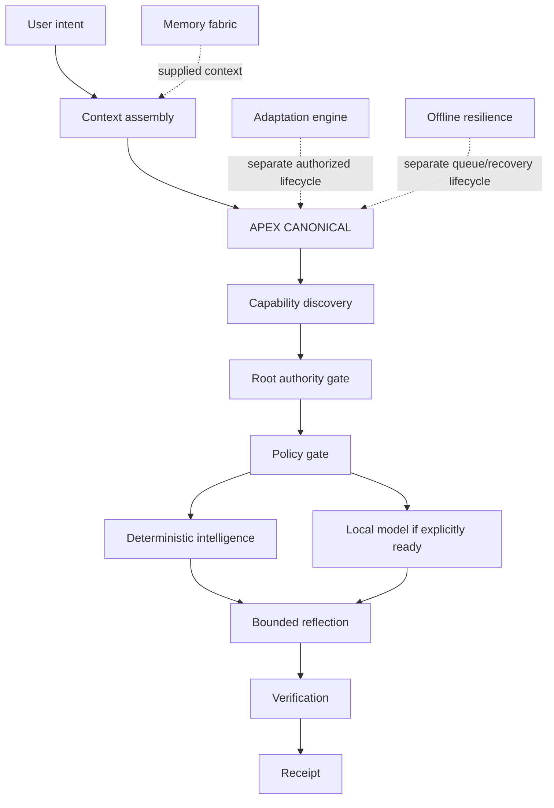

# KEIRA Final Integration Validation

Generated: 2026-10-05T16:16:19.324Z

## Executive verdict

**Evidence-based answer:** KEIRA constitutes a functioning **local-first, deterministic, bounded-recursive, reflective, provenance-aware runtime core**, but not yet a single internally chained runtime in which APEX itself invokes durable memory and adaptation. Memory and adaptation are implemented and composable through separate Portal APIs; APEX directly invokes reflection, verification, and receipts.

Executable result: **15/15 scenarios passed**; **13/13 invariants held**.

## Complete scenario traces

### 1. pure deterministic — PASS

- **Implemented path:** APEX → deterministic capability → bounded reflection → verification → receipt
- **Status:** `COMPLETED`
- **Stages:** INTENT:entered → INTENT:completed → CONTEXT:completed → CAPABILITY_DISCOVERY:entered → CAPABILITY_DISCOVERY:completed → AUTHORIZATION:completed → POLICY:completed → PLAN:completed → EXECUTION:entered → EXECUTION:completed → REFLECTION:entered → REFLECTION:completed → VERIFICATION:entered → VERIFICATION:completed → RECEIPT:completed
- **Receipt IDs:** 18de3dd5-d106-4253-b60e-fb79970532ac
- **Evidence:** selected capability is deterministic; LOCAL radius; external providers disabled
- **Notes:** No database memory is assembled by APEX itself.

### 2. local model — PASS

- **Implemented path:** APEX → local_model capability → supplied local adapter → reflection → verification → receipt
- **Status:** `COMPLETED`
- **Stages:** INTENT:entered → INTENT:completed → CONTEXT:completed → CAPABILITY_DISCOVERY:entered → CAPABILITY_DISCOVERY:completed → AUTHORIZATION:completed → POLICY:completed → PLAN:completed → EXECUTION:entered → EXECUTION:completed → REFLECTION:entered → REFLECTION:completed → VERIFICATION:entered → VERIFICATION:completed → RECEIPT:completed
- **Receipt IDs:** ef9d0339-98a5-4f7b-92d7-3f324f22bb56
- **Evidence:** local model explicitly declared READY; model output marked GENERATED_INFERENCE; reflection revises overconfident wording
- **Notes:** The test adapter is injected; no live model process is claimed.

### 3. memory-assisted — PASS

- **Implemented path:** memory fabric assembly → APEX contextSources → deterministic capability → reflection → receipt
- **Status:** `COMPLETED`
- **Stages:** INTENT:entered → INTENT:completed → CONTEXT:completed → CAPABILITY_DISCOVERY:entered → CAPABILITY_DISCOVERY:completed → AUTHORIZATION:completed → POLICY:completed → PLAN:completed → EXECUTION:entered → EXECUTION:completed → REFLECTION:entered → REFLECTION:completed → VERIFICATION:entered → VERIFICATION:completed → RECEIPT:completed
- **Receipt IDs:** eeae1156-6f31-4e36-b5ad-1e94f69fe37d
- **Evidence:** memory fabric supplied one memory ID; APEX receipt contains that context source
- **Notes:** Memory is assembled outside APEX and passed as declared context; APEX does not query memory itself.

### 4. reflective — PASS

- **Implemented path:** APEX execution → bounded reflection → revision/termination → verification → receipt
- **Status:** `COMPLETED`
- **Stages:** INTENT:entered → INTENT:completed → CONTEXT:completed → CAPABILITY_DISCOVERY:entered → CAPABILITY_DISCOVERY:completed → AUTHORIZATION:completed → POLICY:completed → PLAN:completed → EXECUTION:entered → EXECUTION:completed → REFLECTION:entered → REFLECTION:completed → VERIFICATION:entered → VERIFICATION:completed → RECEIPT:completed
- **Receipt IDs:** 13f91d76-d5b9-4332-953f-a50033f5c4c0
- **Evidence:** reflection records and termination are returned; bounded operation count
- **Notes:** None

### 5. adaptive — PASS

- **Implemented path:** adaptation proposal → evidence threshold → explicit activation → separate APEX request
- **Status:** `COMPLETED`
- **Stages:** INTENT:entered → INTENT:completed → CONTEXT:completed → CAPABILITY_DISCOVERY:entered → CAPABILITY_DISCOVERY:completed → AUTHORIZATION:completed → POLICY:completed → PLAN:completed → EXECUTION:entered → EXECUTION:completed → REFLECTION:entered → REFLECTION:completed → VERIFICATION:entered → VERIFICATION:completed → RECEIPT:completed
- **Receipt IDs:** 8970c3e1-6921-4cca-81ae-95400b1ebc9e
- **Evidence:** proposal eligible; activation ACTIVE; APEX completes separately
- **Notes:** Adaptation is not automatically invoked or applied inside APEX; this is a composed two-step flow.

### 6. offline — PASS

- **Implemented path:** resilience state → authorized queue → APEX local deterministic path
- **Status:** `COMPLETED`
- **Stages:** INTENT:entered → INTENT:completed → CONTEXT:completed → CAPABILITY_DISCOVERY:entered → CAPABILITY_DISCOVERY:completed → AUTHORIZATION:completed → POLICY:completed → PLAN:completed → EXECUTION:entered → EXECUTION:completed → REFLECTION:entered → REFLECTION:completed → VERIFICATION:entered → VERIFICATION:completed → RECEIPT:completed
- **Receipt IDs:** b7a432de-fb88-4ce4-a972-7569ece01cb6
- **Evidence:** OFFLINE; QUEUED; external providers disabled
- **Notes:** Queueing and APEX are separate APIs; no automatic queue drain is claimed.

### 7. unauthorized — PASS

- **Implemented path:** APEX authority gate before execution
- **Status:** `BLOCKED`; failure: `AUTHORITY_REQUIRED`
- **Stages:** INTENT:entered → INTENT:completed → CONTEXT:completed → CAPABILITY_DISCOVERY:entered → CAPABILITY_DISCOVERY:completed → AUTHORIZATION:completed → AUTHORIZATION:blocked → RECEIPT:completed
- **Receipt IDs:** 416e2636-cb98-4d77-bdd9-3f7e06166307
- **Evidence:** no execution trace after authorization; AUTHORITY_REQUIRED
- **Notes:** None

### 8. policy-denied — PASS

- **Implemented path:** APEX policy gate before plan/execution
- **Status:** `BLOCKED`; failure: `POLICY_DENIED`
- **Stages:** INTENT:entered → INTENT:completed → CONTEXT:completed → CAPABILITY_DISCOVERY:entered → CAPABILITY_DISCOVERY:completed → AUTHORIZATION:completed → POLICY:completed → POLICY:blocked → RECEIPT:completed
- **Receipt IDs:** 0e997f0e-0a5e-4ef0-896e-f094bc946be4
- **Evidence:** POLICY_DENIED receipt; no execution stage
- **Notes:** None

### 9. missing-model — PASS

- **Implemented path:** capability discovery rejects unavailable local model
- **Status:** `BLOCKED`; failure: `MODEL_UNAVAILABLE`
- **Stages:** INTENT:entered → INTENT:completed → CONTEXT:completed → CAPABILITY_DISCOVERY:entered → CAPABILITY_DISCOVERY:blocked → CAPABILITY_DISCOVERY:blocked → RECEIPT:completed
- **Receipt IDs:** b2e6beb2-1d6f-4404-800e-6afa5f6f98d6
- **Evidence:** MODEL_UNAVAILABLE
- **Notes:** No remote fallback inferred.

### 10. conflicting-evidence — PASS

- **Implemented path:** memory conflict detection → unavailable context declaration → APEX review
- **Status:** `COMPLETED`
- **Stages:** INTENT:entered → INTENT:completed → CONTEXT:completed → CAPABILITY_DISCOVERY:entered → CAPABILITY_DISCOVERY:completed → AUTHORIZATION:completed → POLICY:completed → PLAN:completed → EXECUTION:entered → EXECUTION:completed → REFLECTION:entered → REFLECTION:completed → VERIFICATION:entered → VERIFICATION:completed → RECEIPT:completed
- **Receipt IDs:** eb4cb1e9-7a19-455a-85fb-0067cda32d64
- **Evidence:** memory fabric requires human review; conflict excluded from included context
- **Notes:** APEX does not independently resolve memory conflicts; it receives the conflict marker as context.

### 11. human-confirmation — PASS

- **Implemented path:** APEX authority/policy confirmation gate
- **Status:** `BLOCKED`; failure: `HUMAN_CONFIRMATION_REQUIRED`
- **Stages:** INTENT:entered → INTENT:completed → CONTEXT:completed → CAPABILITY_DISCOVERY:entered → CAPABILITY_DISCOVERY:completed → AUTHORIZATION:completed → AUTHORIZATION:blocked → RECEIPT:completed
- **Receipt IDs:** 37aa0773-65dd-4b82-806a-9277ac4e105f
- **Evidence:** HUMAN_CONFIRMATION_REQUIRED; no execution
- **Notes:** None

### 12. recovery after interruption — PASS

- **Implemented path:** offline queue → recovery validation → completion idempotency → APEX local request
- **Status:** `COMPLETED`
- **Stages:** INTENT:entered → INTENT:completed → CONTEXT:completed → CAPABILITY_DISCOVERY:entered → CAPABILITY_DISCOVERY:completed → AUTHORIZATION:completed → POLICY:completed → PLAN:completed → EXECUTION:entered → EXECUTION:completed → REFLECTION:entered → REFLECTION:completed → VERIFICATION:entered → VERIFICATION:completed → RECEIPT:completed
- **Receipt IDs:** 30e6ee6b-4193-4cc0-932c-2dbad9a22d47
- **Evidence:** COMPLETED; COMPLETED
- **Notes:** Recovery execution is controlled resilience-controller execution, then APEX is invoked separately.

### 13. revoked authority — PASS

- **Implemented path:** APEX revoked-authority gate
- **Status:** `BLOCKED`; failure: `AUTHORITY_REQUIRED`
- **Stages:** INTENT:entered → INTENT:completed → CONTEXT:completed → CAPABILITY_DISCOVERY:entered → CAPABILITY_DISCOVERY:completed → AUTHORIZATION:completed → AUTHORIZATION:blocked → RECEIPT:completed
- **Receipt IDs:** dfe71693-8de4-4f5f-b1c7-83d7c954dae6
- **Evidence:** AUTHORITY_REQUIRED; no execution
- **Notes:** None

### 14. revoked memory — PASS

- **Implemented path:** memory revocation → excluded context → APEX deterministic request
- **Status:** `COMPLETED`
- **Stages:** INTENT:entered → INTENT:completed → CONTEXT:completed → CAPABILITY_DISCOVERY:entered → CAPABILITY_DISCOVERY:completed → AUTHORIZATION:completed → POLICY:completed → PLAN:completed → EXECUTION:entered → EXECUTION:completed → REFLECTION:entered → REFLECTION:completed → VERIFICATION:entered → VERIFICATION:completed → RECEIPT:completed
- **Receipt IDs:** 60c1dea9-a4c9-4189-aa80-63a1eefb1b0c
- **Evidence:** revoked memory supplied zero IDs; final receipt does not contain the revoked memory ID
- **Notes:** Receipt context includes execution/reflection linkage by contract; it does not indicate revoked memory was supplied.

### 15. external-provider-disabled — PASS

- **Implemented path:** capability discovery reports external provider disabled
- **Status:** `BLOCKED`; failure: `CAPABILITY_UNAVAILABLE`
- **Stages:** INTENT:entered → INTENT:completed → CONTEXT:completed → CAPABILITY_DISCOVERY:entered → CAPABILITY_DISCOVERY:blocked → CAPABILITY_DISCOVERY:blocked → RECEIPT:completed
- **Receipt IDs:** 5b17b5fc-8925-42fc-9846-f5b92598414b
- **Evidence:** CAPABILITY_UNAVAILABLE; external providers disabled
- **Notes:** None

## Invariant validation

- **CAPABILITY ≠ AUTHORITY** — HOLDS: local_tool capability does not execute without authority/consent
- **DECLARED ≠ OBSERVED** — HOLDS: truth-state transition table has separate states and no declared→verified shortcut
- **OBSERVED ≠ VERIFIED** — HOLDS: truth-state requires an explicit OBSERVED→VERIFIED transition
- **VERIFIED ≠ AUTHORIZED** — HOLDS: authorization is checked independently in APEX
- **AUTHORIZED ≠ EXECUTED** — HOLDS: plan and execution are separate trace stages
- **EXECUTED ≠ COMPLETED** — HOLDS: execution result state is linked but final completion is separately verified
- **COMPLETED ≠ ATTESTED** — HOLDS: truth-state table keeps completion and attestation distinct
- **UNKNOWN ≠ FALSE** — HOLDS: UNKNOWN is an information state, not a false value
- **INFERRED ≠ FACT** — HOLDS: memory authority rejects inference provenance classified as known
- **MODEL OUTPUT ≠ TRUTH** — HOLDS: the injected local-model output is revised by bounded reflection; the inner GENERATED_INFERENCE receipt is linked through the execution path, while the final APEX receipt reports pipeline completion
- **FAILURE ≠ SUCCESS** — HOLDS: policy denial returns blocked typed result
- **EXTERNAL ≠ LOCAL** — HOLDS: external capability is disabled and no local/external substitution is hidden
- **PROPOSAL ≠ EXECUTION** — HOLDS: adaptation activation and APEX request remain separate operations

## A. Current KEIRA architecture

- React/Tailwind client and tRPC protected Portal API.
- APEX CANONICAL is the deterministic orchestration boundary.
- Sovereign bus resolves deterministic/local-model capabilities and disables external providers.
- Deterministic engine provides local transformations without model inference.
- Local-model adapter is replaceable and health/configuration gated.
- Reflection engine performs bounded critique/revision with explicit limits.
- Memory fabric provides provenance-aware object creation, conflict detection, revocation, expiry, supersession, and minimum-context assembly.
- Adaptation engine provides proposal-first, evidence-thresholded, shadow/active/rollback lifecycle.
- Offline resilience provides explicit degradation states, queueing, expiry, revocation, recovery validation, and idempotency.
- Receipts link operation, policy, context sources, verification text, and result state.

## B. Component dependency graph



**Implemented:** solid arrows and dotted integration calls represented as separate composition paths. **Not implemented:** internal APEX invocation of memory and adaptation.

## C. Runtime state machine

```text
INTENT → CONTEXT → CAPABILITY_DISCOVERY → AUTHORIZATION → POLICY → PLAN → EXECUTION → REFLECTION → VERIFICATION → RECEIPT
                                                   ↘ BLOCKED / FAILED with typed receipt
Offline controller: FULL → DEGRADED/OFFLINE → RECOVERY → FULL or BLOCKED
Adaptation: PROPOSAL → SHADOW → AUTHORIZED ACTIVE → ROLLED_BACK/REJECTED
Memory: ACTIVE → EXPIRED/SUPERSEDED/REVOKED/CONFLICTED
```

## D. Intelligence pipeline

The executable APEX path is intent, declared context, capability discovery, authority, policy, plan, execution, bounded reflection, verification, and receipt. Deterministic mode is the default smallest local radius. Local model execution requires an explicitly ready local runtime and remains inference, not truth.

## E. Authority model

Authority is checked separately from capability. Identity, authority level, consent, revocation, and consequential-action confirmation are distinct fields. A capability never grants authority. APEX denies missing, revoked, or insufficient authority before execution.

## F. Memory model

Memory objects carry type, source, provenance, information state, confidence, authority, visibility, retention, expiry, revocation, supersession, scope, and related receipts. Conflict detection excludes contradictory active memories and marks human review required. **Boundary:** APEX receives memory IDs/context markers but does not invoke the memory fabric itself.

## G. Reflection model

Reflection is directly invoked by APEX. It is bounded by depth, recursion, operations, time, and token budgets; detects loops, contradictions, policy violations, and insufficient evidence; and may revise output without certifying model output as truth.

## H. Adaptation model

Adaptation is implemented as proposal-first: evidence scoring, risk limits, shadow mode, explicit operator activation, rollback, and persistence APIs. Protected variables such as authority, credentials, security policy, audit rules, trust roots, and external permissions cannot be adapted automatically. **Boundary:** APEX does not automatically call or apply adaptation.

## I. Provenance model

Truth states and information states are distinct. Runtime checks reject malformed states, inference-provenance-as-known, inferred evidence, and invalid transitions. The tested model path records generated inference and reflection revision. This is provenance metadata, not cryptographic attestation.

## J. Receipt model

Receipts contain UUID, timestamp, operation, mode, provider, model, context sources, external/local boundary flags, policy, verification, and result state. APEX emits linked receipts for execution/reflection context. The Stage 9 ledger rejects incomplete and duplicate receipts. **Limitation:** no hash chain or signature yet.

## K. Offline/degradation model

Offline resilience explicitly models FULL, DEGRADED, OFFLINE, RECOVERY, and BLOCKED. It prevents fake success, queues only authorized policy-valid work, enforces expiry, revocation, completion and duplicate checks, and supports snapshot restore. **Boundary:** queue/recovery is a separate controller; real host/network/database fault injection was not performed.

## L. Security findings

- No critical or high failure remains in the executed integration suite.
- Stage 9 previously found and fixed adaptive activation evidence bypass.
- Stage 9 previously found and fixed malformed truth-state runtime handling.
- External providers remain disabled; no silent cloud escalation was observed.
- Remaining security limitations are cryptographic receipt integrity, durable cross-process queue uniqueness, live infrastructure fault injection, and host/dependency compromise.

## M. Test results

- Final integration scenarios: **15/15 passed**.
- Invariants: **13/13 held**.
- TypeScript check: passed.
- Prior full repository gate: **172 tests passed, 1 expected skip**.
- Final integration regression tests added: scenario count, pass status, trace presence, invariant status, and architecture composition boundaries.

## N. Known limitations

1. APEX does not query durable memory internally; callers assemble context and pass source IDs.
2. APEX does not invoke adaptation internally; adaptation is a separate authorized lifecycle.
3. The final APEX receipt reports pipeline completion and links execution/reflection receipt IDs, but does not inline every inner receipt field.
4. Receipt validation is structural and duplicate-resistant, not cryptographically tamper-evident.
5. Offline queue state is process-local unless explicitly snapshotted/persisted.
6. Local-model evidence uses injected adapters in this validation; a live local model process was not required for the pass.
7. External-provider, mesh, arbitrary-tool, and federation paths are disabled or unimplemented, so their live behavior is untested.

## O. Unimplemented capabilities

- Internal APEX memory retrieval and context-fabric invocation.
- Internal APEX adaptation proposal/approval/application workflow.
- Durable cross-process offline queue and idempotency ledger.
- Cryptographic receipt hash chain or signed independent attestation.
- Live trusted-mesh/federation execution.
- Arbitrary tool execution in a sandbox.
- Real host/network/database fault-injection harness.
- Independent second-node verification of provenance and receipts.

## Final answer

**Does KEIRA now constitute a functioning local-first, deterministic, adaptive, bounded-recursive, reflective, provenance-aware intelligence runtime?**

**Yes, with a necessary qualification:** the deterministic/local-first runtime core, bounded reflection, provenance controls, offline controller, and proposal-first adaptation are implemented and passed the requested executable scenarios. **No, if “one coherent runtime” means APEX internally invokes every layer in the requested chain:** memory and adaptation remain separate, explicitly composable APIs, not internal APEX stages. The evidence supports a functioning runtime core plus separate memory/adaptation subsystems—not a fully unified end-to-end intelligence fabric.
